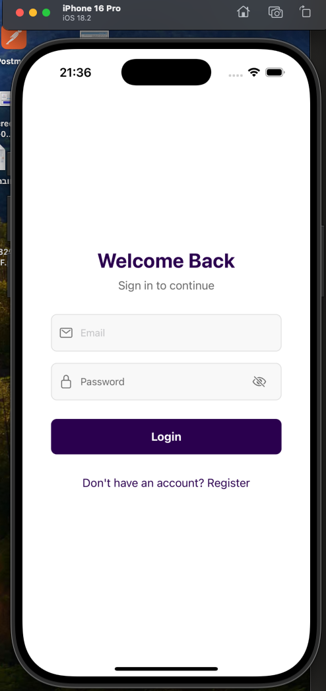
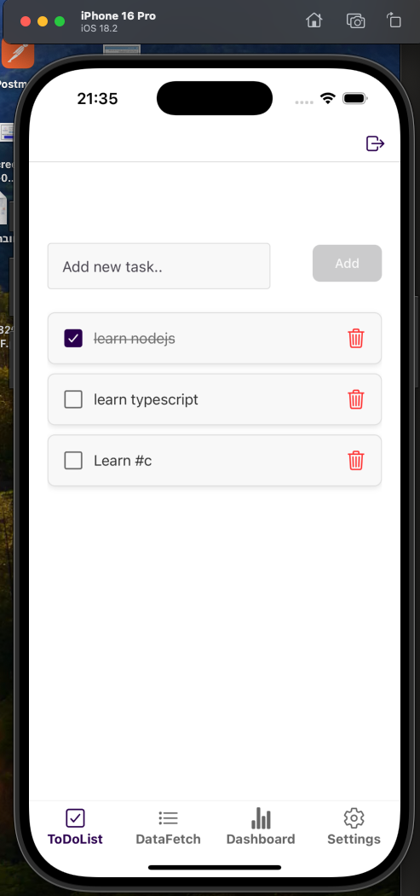
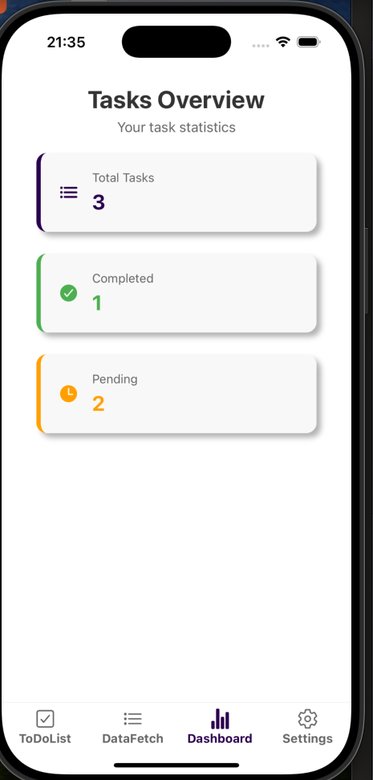
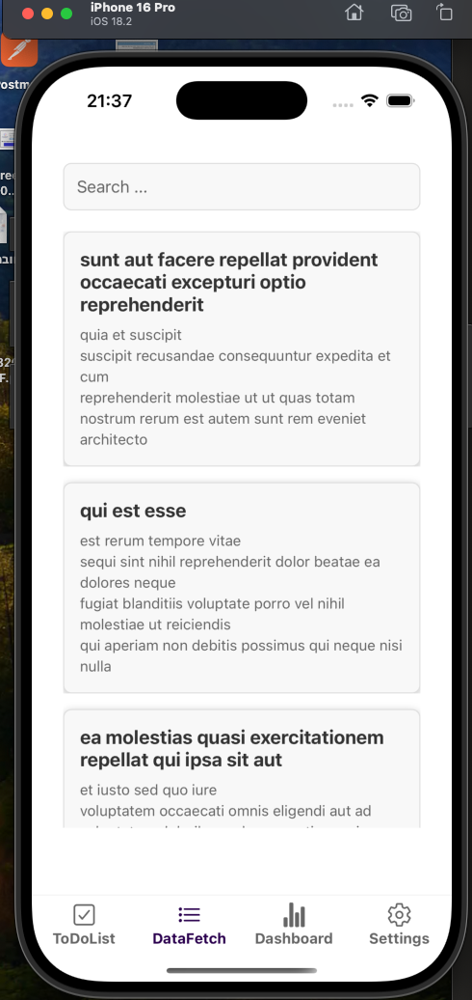

# 📱 React Native ToDo App

A modern local first App, feature-rich application built with React Native, Expo, and TypeScript. This app showcases best practices in mobile development with a focus on user experience and clean architecture.

## ✨ Features

### 🔐 Authentication (MOCK authentication with local storage)
- Secure login and registration system
- Persistent authentication state
- Form validation and error handling

### 📋 Task Management
- Create, read, update, and delete tasks
- Mark tasks as complete/incomplete
- Real-time task status updates
- Smooth animations for task interactions
- Empty state handling

### 📊 Dashboard
- Task statistics overview
- Total tasks counter
- Completed tasks tracking
- Pending tasks monitoring
- Real-time statistics updates

### 📱 Data Features
- Infinite scroll data fetching
- Search functionality
- Loading states
- Error handling
- Empty state handling

### 🎨 Theme System
- Light and dark mode support
- Dynamic theme switching
- Persistent theme preferences
- Consistent styling across the app
- Adaptive status bar

### 🏗️ Architecture & Technical Features
- TypeScript for type safety
- Custom hooks for business logic
- Component reusability
- Clean folder structure
- Expo Router for navigation
- AsyncStorage for local storage local-first
- React Native Paper components
- Responsive design

## 🛠️ Technical Stack

- **React Native** - Mobile framework
- **Expo** - Development platform
- **TypeScript** - Programming language
- **React Navigation** - Navigation library
- **AsyncStorage** - Local storage
- **React Native Paper** - UI components
- **Expo Router** - File-based routing
- **React Native Reanimated** - Animations

## 📂 Project Structure

```
src/
├── app/                    # Expo Router files
│   ├── (tabs)/            # Tab navigation
│   └── _layout.tsx        # Root layout
|   └── login.tsx         #login route
|   └── register.tsx      #register route 
├── features/              # Feature-based modules
│   ├── auth/              # Authentication feature
│   ├── todo/              # Todo management
│   ├── dashboard/         # Statistics & overview
│   ├── settings/          # App settings
│   └── fetchData/         # Data fetching

```

## 🚀 Getting Started

1. **Clone the repository**
```bash
git clone https://github.com/alexg-93/zigit-rn-assignment.git
```

2. **Install dependencies**
```bash
cd react-native-todo-app
npm install
```

3. **Start the development server**
```bash
npx expo start
```

4. **Run on your device/simulator**
- Press `i` for iOS simulator
- Press `a` for Android simulator
- Scan QR code with Expo Go app for physical device

## 📱 Screenshots







## 👨‍💻 Author

- Alex Godienko
- LinkedIn: https://www.linkedin.com/in/alex-gordienko93/

---

⭐️ Star this repo if you like it!
